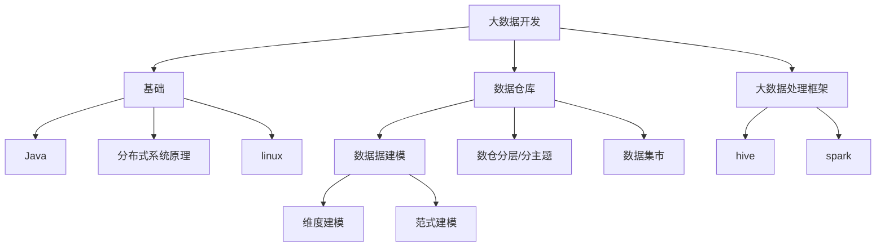

# BigDataLearingGuide
自己梳理的大数据学习知识框架，同时也会包括收集的好文章 and 面经！

## 大数据框架
### Hive
#### 表结构

```mermaid
graph TD
root[大数据开发]
root -->foudation[基础]
root --> dw[数据仓库]
root -->big_data_compute[大数据处理框架]

foudation-->Java
foudation-->distributed_sys[分布式系统原理]
foudation-->linux

dw-->data_model[数据据建模]
data_model-->维度建模
data_model-->范式建模

dw-->dw_hierarchical[数仓分层/分主题]
dw-->dm[数据集市]


big_data_compute-->hive
big_data_compute-->spark

```
